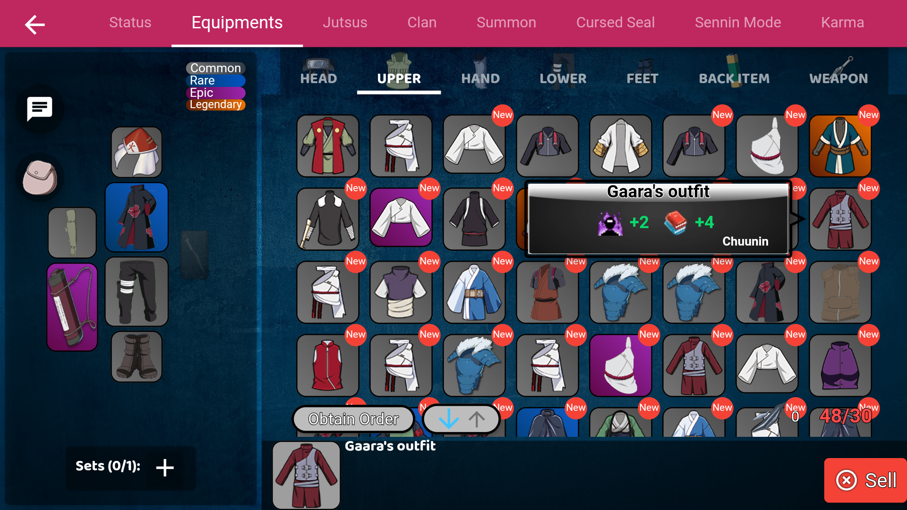

    
    <h1>Ninja Mobile - Will of Fire</h1>

In the game, you'll be a ninja and your mission is to develop your skills and chart your own ninja path to becoming a Kage!!

> Note: The application was developed 100% in Flutter. The source code contained in this repository is just the shell of a project. The current application code is kept private.

## Download App
<a href="https://play.google.com/store/apps/details?id=com.gutotech.borutogame"></img></a>

## Screenshots

    
    
    
    
    
    
    
    
    
    
    
    
    
    
    
    

